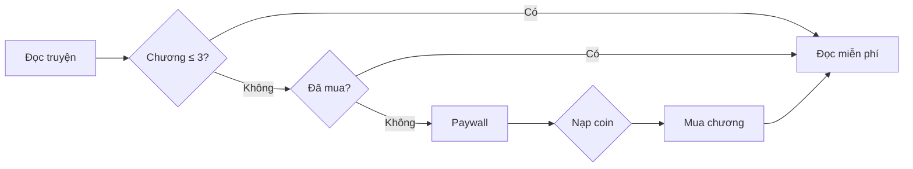

# KEWE — Nền tảng đọc sách & truyện online

Website đọc sách/truyện trực tuyến xây dựng bằng **PHP thuần** và **MySQL**, phục vụ đồ án môn **Chuyên đề định hướng**. Hệ thống cho phép người dùng đọc truyện theo chương, mua chương trả phí bằng coin, nạp coin qua QR (demo), lưu truyện vào tủ sách, bình luận; quản trị viên quản lý truyện, chương, người dùng, bình luận và xem thống kê.

**Chạy nhanh:** Bật Apache + MySQL (XAMPP) → mở `[http://localhost/chuyende/frontend/home.php](http://localhost/chuyende/frontend/home.php)`

---

## Mục lục

1. [Tính năng](#tính-năng)
2. [Mô hình kinh doanh](#mô-hình-kinh-doanh)
3. [Công nghệ](#công-nghệ)
4. [Cấu trúc thư mục](#cấu-trúc-thư-mục)
5. [Cơ sở dữ liệu](#cơ-sở-dữ-liệu)
6. [Luồng nghiệp vụ](#luồng-nghiệp-vụ)
7. [Cài đặt & chạy](#cài-đặt--chạy)
8. [Tài khoản & phân quyền](#tài-khoản--phân-quyền)
9. [Cấu hình](#cấu-hình)
10. [API & endpoint chính](#api--endpoint-chính)
11. [Hạn chế & ghi chú](#hạn-chế--ghi-chú)
12. [Kiểm thử nhanh](#kiểm-thử-nhanh)
13. [Test case](#test-case)
14. [Tác giả](#tác-giả)

---

## Tính năng

### Người đọc (`role = user`)


| Chức năng                       | Mô tả                                                                    |
| ------------------------------- | ------------------------------------------------------------------------ |
| Đăng ký / đăng nhập / đăng xuất | Mật khẩu mã hóa `password_hash`; tài khoản `banned` không đăng nhập được |
| Trang chủ & danh mục            | Banner slider (Swiper), lọc theo 24 thể loại sách/truyện                 |
| Đọc truyện                      | Trang chi tiết (`read_story.php`) + đọc chương (`read_chapter.php`)      |
| Paywall                         | **3 chương đầu miễn phí**, từ chương 4 mua bằng **3 coin/chương**        |
| Nạp coin                        | Chọn gói → tạo đơn → quét QR VietQR (demo) → xác nhận cộng coin          |
| Tủ sách                         | Xem truyện đã lưu và chương đã mua; lưu truyện yêu thích                 |
| Tìm kiếm                        | Gợi ý AJAX real-time trên header + trang `timkiem.php`                   |
| Bình luận                       | Bình luận gốc & trả lời (reply); xóa comment của chính mình              |
| Tài khoản                       | Xem số dư coin, lịch sử giao dịch, thông tin cá nhân                     |


### Quản trị viên (`role = admin`)


| Chức năng         | Mô tả                                                            |
| ----------------- | ---------------------------------------------------------------- |
| Dashboard         | Tổng user, truyện, lượt xem, bình luận                           |
| Thống kê          | Top truyện theo `luot_xem`, % user active, cơ cấu thể loại       |
| Quản lý truyện    | CRUD, upload ảnh bìa (validate MIME), lọc theo tên/trạng thái    |
| Quản lý chương    | Thêm/sửa/xóa chương theo truyện                                  |
| Quản lý user      | CRUD, khóa (`banned`) / mở khóa, phân quyền                      |
| Quản lý bình luận | Xem, xóa bình luận; khóa/mở khóa user từ trang bình luận         |
| Bypass paywall    | Admin đọc mọi chương trả phí không cần mua (kiểm duyệt nội dung) |


> **Lưu ý UI:** Admin **không** có Nạp coin / Tủ sách — dropdown chỉ hiển thị link **Quản trị viên**. Nút **Lưu truyện** cũng bị ẩn trên các trang danh mục.

---

## Mô hình kinh doanh

Hệ thống dùng mô hình **freemium** kết hợp **coin nội bộ**:


| Thành phần         | Giá trị mặc định               |
| ------------------ | ------------------------------ |
| Chương miễn phí    | 3 chương đầu mỗi truyện        |
| Giá chương trả phí | 3 coin / chương                |
| Tỷ giá nạp (demo)  | 1 coin = 10 VND                |
| Gói nạp            | 10, 30, 50, 100, 200, 500 coin |





**Điểm mạnh logic:** Paywall tập trung tại `read_chapter.php`; mua chương dùng **transaction** (trừ coin + ghi `purchased_chapters` + lịch sử); admin bypass rõ ràng; user bị ban bị chặn qua `require_active_user()`.

**Điểm cần cải thiện (nếu triển khai thật):** Thanh toán chỉ là demo (không xác minh chuyển khoản); chưa có CSRF token; `luutruyen.php` chỉ **lưu** truyện, chưa có chức năng **bỏ lưu**.

---

## Công nghệ


| Thành phần      | Công nghệ                                            |
| --------------- | ---------------------------------------------------- |
| Backend         | PHP 7.4+ (mysqli, prepared statements, transactions) |
| Database        | MySQL / MariaDB, `utf8mb4`                           |
| Frontend        | HTML5, CSS3, JavaScript (Fetch API)                  |
| Thư viện JS     | Swiper.js 11 (banner/hero carousel)                  |
| Icon            | Font Awesome 6.5                                     |
| Thanh toán demo | VietQR (`img.vietqr.io`) — không tích hợp cổng thật  |


---

## Cấu trúc thư mục

```
chuyende/
├── backend/                      # Logic xử lý, API, trang đọc
│   ├── require_admin.php         # Guard admin (pages + API JSON)
│   ├── require_auth.php          # Guard user đăng nhập + status active
│   ├── story_config.php          # FREE_CHAPTERS, COINS_PER_CHAPTER, mã danh mục
│   ├── payment_config.php        # Cấu hình VietQR, gói nạp coin
│   ├── connect.php               # Kết nối DB (mysqli) — dùng ở một số backend file
│   ├── dangnhap_logic.php        # Xử lý đăng nhập (prepared statement)
│   ├── dangky_logic.php          # Xử lý đăng ký (prepared statement)
│   ├── logout.php                # Hủy session, redirect home
│   ├── read_story.php            # Chi tiết truyện, bình luận, luot_xem
│   ├── read_chapter.php          # Đọc chương, paywall, login modal
│   ├── buy_chapter.php           # Mua chương bằng coin (transaction)
│   ├── topup_create_order.php    # Tạo đơn nạp coin
│   ├── topup_confirm_paid.php    # Xác nhận thanh toán demo, cộng coin
│   ├── topup_coin.php            # Redirect legacy → napcoin.php
│   ├── search_ajax.php           # API tìm kiếm JSON (prepared statement)
│   ├── add_story.php             # CRUD truyện (admin, validate MIME upload)
│   ├── edit_story.php            # Sửa thông tin truyện (admin)
│   ├── delete_story.php          # Xóa truyện + cascade (admin, transaction)
│   ├── add_chapter.php           # Thêm chương (admin)
│   ├── edit_chapter.php          # Sửa chương (admin)
│   ├── delete_chapter.php        # Xóa chương (admin)
│   ├── add_user.php              # Thêm user (admin)
│   ├── edit_user.php             # Sửa user (admin)
│   ├── delete_user.php           # Xóa user + guard admin cuối (admin)
│   ├── script.js                 # Modal login/register, URL param auto-open
│   └── uploads/                  # Ảnh bìa upload từ admin
│
├── frontend/
│   ├── home.php                  # Trang chủ (banner, book grid, modals)
│   ├── timkiem.php               # Tìm kiếm đầy đủ
│   ├── tatca.php                 # Danh sách tất cả sách (phân trang)
│   ├── napcoin.php               # Chọn gói nạp coin
│   ├── thanhtoan.php             # Trang QR thanh toán
│   ├── taikhoan.php              # Thông tin tài khoản, lịch sử giao dịch
│   ├── tusach.php                # Tủ sách cá nhân (đã lưu + đã mua)
│   ├── luutruyen.php             # API lưu truyện (POST, chỉ INSERT)
│   ├── dangnhap_form.php         # Fragment form đăng nhập (modal)
│   ├── dangky_form.php           # Fragment form đăng ký (modal)
│   ├── _category_template.php    # Template danh mục dùng chung (hero + grid)
│   │
│   ├── [24 trang thể loại]       # taichinhcanhan.php, tinhcam.php, …
│   │
│   ├── includes/
│   │   └── paths.php             # app_url(), cover_url(), app_login_url(), app_safe_redirect()
│   │
│   ├── admin/
│   │   ├── index.php             # Dashboard tổng quan
│   │   ├── thongke.php           # Thống kê chi tiết
│   │   ├── stories.php           # Quản lý truyện
│   │   ├── chapter.php           # Quản lý chương
│   │   ├── users.php             # Quản lý người dùng
│   │   ├── comments.php          # Quản lý bình luận
│   │   └── sidebar.php           # Sidebar admin (shared)
│   │
│   ├── css/                      # style.css, user.css, category.css, …
│   └── js/
│       └── search-ajax.js        # Client-side AJAX search
│
├── database/
│   ├── connect.php               # Kết nối DB + auto-migration (dùng chính)
│   ├── db_connect.php            # Tạo DB/bảng lần đầu (bootstrap)
│   └── update_schema.sql         # Migration bổ sung (coin, orders, …)
│
├── code/images/                  # Ảnh bìa tĩnh mặc định
└── README.md
```

---

## Cơ sở dữ liệu

**Database:** `db_BTL5` — cấu hình tại `database/connect.php`

### Bảng chính


| Bảng                 | Mô tả                                                                   |
| -------------------- | ----------------------------------------------------------------------- |
| `users`              | Tài khoản: username, email, sdt, password (bcrypt), coins, role, status |
| `stories`            | Truyện: title, description (mã danh mục), cover, status, luot_xem       |
| `chapters`           | Chương: story_id, title, content, chapter_number                        |
| `user_stories`       | Truyện đã lưu vào tủ sách                                               |
| `purchased_chapters` | Chương đã mua bằng coin                                                 |
| `coin_transactions`  | Lịch sử nạp/tiêu coin (type: topup/spend)                               |
| `topup_orders`       | Đơn nạp coin (status: pending / paid)                                   |
| `comments`           | Bình luận (hỗ trợ parent_id cho reply)                                  |


### Quan hệ (tóm tắt)

```
users ──┬── user_stories ── stories ── chapters
        ├── purchased_chapters ── chapters
        ├── coin_transactions
        ├── topup_orders
        └── comments ── stories
```

### Auto-migration

`database/connect.php` tự thêm cột/bảng thiếu mỗi lần chạy (coins, role, status, luot_xem, purchased_chapters, topup_orders, coin_transactions, …) — phù hợp môi trường demo XAMPP, không cần import SQL thủ công.

---

## Luồng nghiệp vụ

### Đăng nhập

```
User → home.php (modal) → POST dangnhap_logic.php
  → Kiểm tra password_verify() + status ≠ banned
  → Set session: user_id, username, role
  → app_safe_redirect() → trang trước hoặc home
```

Trang yêu cầu đăng nhập dùng `require_active_user()` — user bị ban giữa phiên bị logout ngay khi truy cập trang bảo vệ.

### Đọc & mua chương

```
read_story.php   → tăng luot_xem (mỗi lần GET)
read_chapter.php → chương ≤ FREE_CHAPTERS (3): miễn phí
                 → chương > 3 + đã mua (purchased_chapters): cho đọc
                 → chương > 3 + chưa mua: hiển thị paywall
                 → admin: bypass paywall
buy_chapter.php  → kiểm tra coin đủ
                 → transaction: UPDATE users SET coins - COINS_PER_CHAPTER
                              + INSERT purchased_chapters
                              + INSERT coin_transactions
```

Hằng số nghiệp vụ tập trung tại `backend/story_config.php`:

```php
define('FREE_CHAPTERS', 3);      // Số chương miễn phí
define('COINS_PER_CHAPTER', 3);  // Giá mỗi chương trả phí
```

### Nạp coin (demo VietQR)

```
napcoin.php → POST topup_create_order.php
           → tạo bản ghi topup_orders (status=pending)
           → redirect thanhtoan.php?order_id=…
           → hiển thị QR từ img.vietqr.io
           → POST topup_confirm_paid.php
           → transaction: UPDATE users SET coins + coins
                        + INSERT coin_transactions (type=topup)
                        + UPDATE topup_orders SET status=paid
           → redirect napcoin.php?success=1
```

> Đây là **mô phỏng**: người dùng bấm "Tôi đã thanh toán", hệ thống cộng coin — không có webhook ngân hàng thật.

### Lưu truyện & tủ sách

```
POST luutruyen.php (story_id)
  → INSERT user_stories (bỏ qua nếu đã lưu)
  → redirect về trang trước + thông báo

tusach.php → hiển thị truyện đã lưu + chương đã mua
```

### Admin CRUD

```
frontend/admin/*.php  → require_admin() (redirect nếu không phải admin)
backend/*_story|chapter|user.php → require_admin_api() (trả JSON 403)
Xóa truyện → cascade: chapters, comments, user_stories (transaction)
Xóa user   → kiểm tra không phải admin cuối cùng
```

---

## Cài đặt & chạy

### Yêu cầu

- [XAMPP](https://www.apachefriends.org/) (Apache + MySQL) hoặc WAMP / Laragon
- PHP **7.4+** (khuyến nghị 8.x)
- Trình duyệt Chrome / Edge / Firefox

### Bước 1 — Copy project

Đặt thư mục vào `htdocs`:

```
C:\xampp\htdocs\chuyende\
```

### Bước 2 — Bật dịch vụ

XAMPP Control Panel → **Start Apache** và **MySQL**.

### Bước 3 — Database

**Cách khuyến nghị:** Truy cập trang chủ — hệ thống tự tạo DB và migrate đầy đủ qua `database/connect.php`.

**Cách thủ công:** Chạy `database/db_connect.php` một lần để tạo DB + bảng gốc, sau đó import `database/update_schema.sql` nếu cần.

**Cấu hình mặc định** (`database/connect.php`):


| Tham số  | Giá trị     |
| -------- | ----------- |
| Host     | `localhost` |
| User     | `root`      |
| Password | *(trống)*   |
| Database | `db_BTL5`   |


### Bước 4 — Truy cập


| Trang       | URL                                                  |
| ----------- | ---------------------------------------------------- |
| Trang chủ   | `http://localhost/chuyende/frontend/home.php`        |
| Tất cả sách | `http://localhost/chuyende/frontend/tatca.php`       |
| Tìm kiếm    | `http://localhost/chuyende/frontend/timkiem.php`     |
| Nạp coin    | `http://localhost/chuyende/frontend/napcoin.php`     |
| Tủ sách     | `http://localhost/chuyende/frontend/tusach.php`      |
| Tài khoản   | `http://localhost/chuyende/frontend/taikhoan.php`    |
| Admin       | `http://localhost/chuyende/frontend/admin/index.php` |


---

## Tài khoản & phân quyền

### Tạo user thường

Form **Đăng ký** trên trang chủ (modal) hoặc admin thêm user tại `admin/users.php`.

### Tạo tài khoản admin

1. Đăng ký tài khoản bình thường
2. Vào **phpMyAdmin** chạy:

```sql
UPDATE users SET role = 'admin' WHERE username = 'ten_tai_khoan';
```

1. Đăng xuất → Đăng nhập lại

### Phân quyền


| Role    | Quyền                                                             |
| ------- | ----------------------------------------------------------------- |
| `user`  | Đọc, mua chương, nạp coin, tủ sách, bình luận                     |
| `admin` | Toàn bộ panel quản trị; **không** nạp coin / tủ sách / lưu truyện |


### Khóa tài khoản

Admin đặt `status = 'banned'` → user không đăng nhập được; session cũ bị chặn ngay khi truy cập trang bảo vệ.

---

## Cấu hình

### Coin & paywall — `backend/story_config.php`

```php
define('FREE_CHAPTERS', 3);      // Số chương miễn phí đầu
define('COINS_PER_CHAPTER', 3);  // Giá mỗi chương trả phí
```

### Thanh toán demo — `backend/payment_config.php`

```php
define('PAYMENT_BANK', 'MB');              // Mã ngân hàng
define('PAYMENT_ACCOUNT', '0123456789');   // Số tài khoản nhận
define('PAYMENT_ACCOUNT_NAME', 'KEWE PLATFORM');
```

Gói nạp hợp lệ: **10, 30, 50, 100, 200, 500** coin. Tỷ giá demo: **1 coin = 10 VND**.

### Mã danh mục — `stories.description`

Cột `description` lưu **mã thể loại** (không phải mô tả dài). Danh sách đầy đủ nằm trong `story_category_labels()` tại `backend/story_config.php`.


| Mã           | Tên hiển thị         | Trang frontend             |
| ------------ | -------------------- | -------------------------- |
| `home`       | Trang chủ / nổi bật  | `home.php`                 |
| `tho`        | Thơ - Tản văn        | `tho_tanvan.php`           |
| `trinhtham`  | Trinh thám - Kinh dị | `trinhtham.php`            |
| `taichinh`   | Tài chính cá nhân    | `taichinhcanhan.php`       |
| `ptcanhan`   | Phát triển cá nhân   | `pt_canhan.php`            |
| `doanh_nhan` | Doanh nhân           | `doanh_nhan.php`           |
| `suckhoe`    | Sức khỏe - Làm đẹp   | `suckhoe_lamdep.php`       |
| `khoahoc`    | Khoa học - Công nghệ | `khoahoc_congnghe.php`     |
| `tuduy`      | Tư duy sáng tạo      | `tuduy_sangtao.php`        |
| `giaoduc`    | Giáo dục - Văn hóa   | `giaoduc_vanhoa.php`       |
| `nghethuat`  | Nghệ thuật sống      | `nghe_thuat_song.php`      |
| `tamlinh`    | Tâm linh - Tôn giáo  | `tamlinh.php`              |
| `chungkhoan` | Chứng khoán - BĐS    | `chungkhoan_bds_dautu.php` |
| `mkt`        | Marketing - Bán hàng | `mkt_banhang.php`          |
| `ngoai_van`  | Sách Ngoại văn       | `sach_ngoai_van.php`       |
| `nam`        | Truyện Nam           | `nam.php`                  |
| `nu`         | Truyện Nữ            | `nu.php`                   |
| `tinhcam`    | Tình cảm             | `tinhcam.php`              |
| `xuyenkhong` | Xuyên không          | `xuyenkhong.php`           |
| `truyenma`   | Truyện ma            | `truyenma.php`             |
| `codai`      | Cổ đại               | `codai.php`                |
| `ngungon`    | Ngụ ngôn             | `ngungon.php`              |
| `haihuoc`    | Hài hước             | `haihuoc.php`              |
| `hanhdong`   | Hành động            | `hanhdong.php`             |
| `thieunhi`   | Thiếu nhi            | `thieunhi.php`             |


### Ảnh bìa — `frontend/includes/paths.php`

Hàm `cover_url($cover)` tự xử lý đường dẫn:

- Ảnh upload admin → `backend/uploads/…`
- Ảnh mặc định → `code/images/…`

---

## API & endpoint chính

### Tìm kiếm AJAX

```
GET /chuyende/backend/search_ajax.php?q={từ_khóa}[&limit={1-50}]
```

Phản hồi JSON: `{ success, count, keyword, items: [{id, title, cover, category, url}] }`

### Nạp coin


| Method | File                     | Mô tả                                        |
| ------ | ------------------------ | -------------------------------------------- |
| POST   | `topup_create_order.php` | Tạo đơn, redirect `thanhtoan.php?order_id=…` |
| POST   | `topup_confirm_paid.php` | Xác nhận demo, cộng coin vào tài khoản       |


### Mua chương


| Method | File              | Mô tả                                            |
| ------ | ----------------- | ------------------------------------------------ |
| POST   | `buy_chapter.php` | Trừ coin (transaction), ghi `purchased_chapters` |


### Lưu truyện


| Method | File            | Mô tả                                             |
| ------ | --------------- | ------------------------------------------------- |
| POST   | `luutruyen.php` | Lưu truyện vào `user_stories` (yêu cầu đăng nhập) |


### Admin API (JSON — yêu cầu session admin)


| File                                                          | Chức năng       |
| ------------------------------------------------------------- | --------------- |
| `add_story.php` / `edit_story.php` / `delete_story.php`       | CRUD truyện     |
| `add_chapter.php` / `edit_chapter.php` / `delete_chapter.php` | CRUD chương     |
| `add_user.php` / `edit_user.php` / `delete_user.php`          | CRUD người dùng |


### Helper functions — `frontend/includes/paths.php`


| Hàm                          | Mô tả                                 |
| ---------------------------- | ------------------------------------- |
| `app_url($path)`             | URL tuyệt đối từ root project         |
| `cover_url($cover)`          | URL ảnh bìa (uploads vs code/images)  |
| `app_login_url($redirect)`   | URL home với `?open=login&redirect=…` |
| `app_safe_redirect($target)` | Validate & trả URL redirect an toàn   |


---

## Hạn chế & ghi chú


| Hạng mục          | Ghi chú                                                              |
| ----------------- | -------------------------------------------------------------------- |
| Thanh toán        | Demo VietQR — không xác minh chuyển khoản thật                       |
| CSRF              | Chưa có CSRF token; phù hợp môi trường đồ án / localhost             |
| Bỏ lưu truyện     | `luutruyen.php` chỉ INSERT; chưa có API/UI bỏ lưu                    |
| `add_chapter.php` | `story_id` không cast `intval()` trước SQL (admin-only, rủi ro thấp) |
| `topup_coin.php`  | File legacy, chỉ redirect sang `napcoin.php`                         |
| Toast vs alert    | Một số trang vẫn dùng `alert()` (vd. `luutruyen.php`)                |


---

## Kiểm thử nhanh

- [ ] Đăng ký tài khoản mới
- [ ] Đăng nhập / đăng xuất
- [ ] Đọc 3 chương đầu miễn phí; chương 4 yêu cầu coin
- [ ] Nạp coin qua QR → số dư tăng
- [ ] Mua chương → đọc được nội dung
- [ ] Lưu truyện vào tủ sách
- [ ] Bình luận & trả lời bình luận
- [ ] Tìm kiếm theo tên truyện (AJAX dropdown + trang kết quả)
- [ ] Admin: CRUD truyện, chương, user
- [ ] Admin: quản lý bình luận, xem dashboard và thống kê
- [ ] Admin: bypass đọc chương trả phí không cần mua
- [ ] Admin: dropdown chỉ hiển thị "Quản trị viên" (không có Tủ sách / Nạp Coin)
- [ ] User bị `banned` không đăng nhập được
- [ ] `luot_xem` tăng mỗi lần mở trang truyện

---

<<<<<<< HEAD
## Báo cáo test case

Bộ test case đã kiểm thử (**62 case**, **100% Pass**):

- [`TESTCASE.md`](TESTCASE.md) — Báo cáo đầy đủ kèm kết quả thực tế
- [`TESTCASE.csv`](TESTCASE.csv) — Import Excel/Google Sheets
- [`tests/run_smoke_test.php`](tests/run_smoke_test.php) — Script kiểm thử tự động

---

## Tác giả
=======
## Test case
>>>>>>> origin/main

Bộ test case chi tiết (**79 case**) theo module:

- [`TESTCASE.md`](TESTCASE.md) — bảng đầy đủ, dùng khi viết báo cáo
- [`TESTCASE.csv`](TESTCASE.csv) — import Excel/Google Sheets để điền Pass/Fail

---

## Tác giả


|                          |                                              |
| ------------------------ | -------------------------------------------- |
| **Đề tài**               | Xây dựng website đọc sách/truyện online KEWE |
| **Môn học**              | Chuyên đề định hướng                         |
| **Nhóm**                 | Nhóm 1                                       |
| **Giảng viên hướng dẫn** | Ths. Ngô Ngọc Anh                            |
| **Năm học**              | 2025 – 2026                                  |


---
