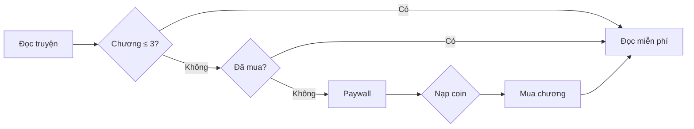

# KEWE — Nền tảng đọc sách & truyện online

Website đọc sách/truyện trực tuyến xây dựng bằng **PHP thuần** và **MySQL**, phục vụ đồ án môn **Chuyên đề định hướng**. Hệ thống cho phép người dùng đọc truyện theo chương, mua chương trả phí bằng coin, nạp coin qua QR (demo), lưu/bỏ lưu truyện, bình luận; quản trị viên quản lý truyện, chương, người dùng, bình luận và xem thống kê.

**Chạy nhanh:** Bật Apache + MySQL (XAMPP) → mở `http://localhost/chuyende/frontend/home.php`

---

## Mục lục

1. [Tính năng](#tính-năng)
2. [Mô hình kinh doanh](#mô-hình-kinh-doanh)
3. [Công nghệ](#công-nghệ)
4. [Cấu trúc thư mục](#cấu-trúc-thư-mục)
5. [Cơ sở dữ liệu](#cơ-sở-dữ-liệu)
6. [Luồng nghiệp vụ](#luồng-nghiệp-vụ)
7. [Cài đặt & chạy](#cài-đặt--chạy)
8. [Tài khoản & phân quyền](#tài-khoản--phân-quyền)
9. [Cấu hình](#cấu-hình)
10. [API & endpoint chính](#api--endpoint-chính)
11. [Hạn chế & ghi chú](#hạn-chế--ghi-chú)
12. [Kiểm thử](#kiểm-thử)
13. [Tác giả](#tác-giả)

---

## Tính năng

### Người đọc (`role = user`)

| Chức năng | Mô tả |
|-----------|--------|
| Đăng ký / đăng nhập / đăng xuất | Mật khẩu `password_hash`; tài khoản `banned` không đăng nhập được |
| Trang chủ & danh mục | Banner Swiper, 24 thể loại sách/truyện |
| Đọc truyện | `read_story.php` + `read_chapter.php` |
| Paywall | **3 chương đầu miễn phí**, từ chương 4 mua **3 coin/chương** |
| Nạp coin | Gói coin → QR VietQR (demo) → xác nhận cộng coin |
| Tủ sách | Lưu/bỏ lưu truyện (nút tim); xóa trên `tusach.php`; xem chương đã mua |
| Tìm kiếm | AJAX dropdown header + `timkiem.php` |
| Bình luận | Comment, reply, xóa comment của mình |
| Tài khoản | Số dư coin, lịch sử giao dịch, thông tin cá nhân |
| Thông báo | Toast thống nhất (`includes/toast.php`) thay `alert()` |

### Quản trị viên (`role = admin`)

| Chức năng | Mô tả |
|-----------|--------|
| Dashboard | Tổng user, truyện, lượt xem, bình luận |
| Thống kê | Top truyện, % user active, cơ cấu thể loại |
| Quản lý truyện | CRUD, upload ảnh bìa (validate MIME) |
| Quản lý chương | Thêm/sửa/xóa chương |
| Quản lý user | CRUD, khóa/mở khóa, phân quyền |
| Quản lý bình luận | Xem, xóa; khóa user từ trang comment |
| Bypass paywall | Đọc mọi chương trả phí không cần mua |

> Admin **không** có Nạp coin / Tủ sách — dropdown chỉ hiển thị **Quản trị viên**. Nút **Lưu truyện** bị ẩn trên danh mục.

---

## Mô hình kinh doanh

| Thành phần | Giá trị mặc định |
|------------|------------------|
| Chương miễn phí | 3 chương đầu / truyện |
| Giá chương trả phí | 3 coin / chương |
| Tỷ giá nạp (demo) | 1 coin = 10 VND |
| Gói nạp | 10, 30, 50, 100, 200, 500 coin |



---

## Công nghệ

| Thành phần | Công nghệ |
|------------|-----------|
| Backend | PHP 7.4+ (mysqli, prepared statements, transactions) |
| Database | MySQL / MariaDB, `utf8mb4` |
| Frontend | HTML5, CSS3, JavaScript |
| Thư viện | Swiper.js 11, Font Awesome 6.5 |
| Thanh toán demo | VietQR (`img.vietqr.io`) |

---

## Cấu trúc thư mục

```
chuyende/
├── backend/
│   ├── require_admin.php, require_auth.php
│   ├── story_config.php, payment_config.php
│   ├── dangnhap_logic.php, dangky_logic.php
│   ├── read_story.php, read_chapter.php, buy_chapter.php
│   ├── topup_create_order.php, topup_confirm_paid.php
│   ├── search_ajax.php
│   ├── add/edit/delete_* (story, chapter, user)
│   └── uploads/
├── frontend/
│   ├── home.php, tatca.php, timkiem.php
│   ├── napcoin.php, thanhtoan.php, taikhoan.php, tusach.php
│   ├── luutruyen.php          # POST lưu/bỏ lưu (action=save|unsave)
│   ├── _category_template.php # Template 24 thể loại
│   ├── includes/
│   │   ├── paths.php          # app_url, cover_url, redirect toast
│   │   └── toast.php          # Thông báo toast dùng chung
│   └── admin/                 # index, thongke, stories, chapter, users, comments
├── database/
│   ├── connect.php            # Kết nối + auto-migration
│   ├── db_connect.php
│   └── update_schema.sql
├── tests/
│   └── run_smoke_test.php     # Smoke test tự động
├── code/images/
├── README.md
└── TESTCASE.md
```

---

## Cơ sở dữ liệu

**Database:** `db_BTL5` — `database/connect.php`

| Bảng | Mô tả |
|------|--------|
| `users` | username, email, sdt, password, coins, role, status |
| `stories` | title, description (mã danh mục), cover, luot_xem |
| `chapters` | story_id, title, content, chapter_number |
| `user_stories` | Truyện đã lưu |
| `purchased_chapters` | Chương đã mua |
| `coin_transactions` | Lịch sử nạp/tiêu coin |
| `topup_orders` | Đơn nạp (pending / paid) |
| `comments` | Bình luận (parent_id cho reply) |

`database/connect.php` tự migrate cột/bảng thiếu khi chạy — phù hợp XAMPP demo.

---

## Luồng nghiệp vụ

### Đăng nhập

```
home.php (modal) → POST dangnhap_logic.php
  → password_verify + status ≠ banned
  → session: user_id, username, role
  → app_safe_redirect()
```

### Đọc & mua chương

```
read_chapter.php → chương ≤ 3: miễn phí
                 → chương > 3 + đã mua: đọc
                 → chương > 3 + chưa mua: paywall
                 → admin: bypass
buy_chapter.php  → transaction trừ coin + ghi purchased_chapters
```

### Nạp coin (demo)

```
napcoin.php → topup_create_order.php → thanhtoan.php (QR)
           → topup_confirm_paid.php → cộng coin (demo, không webhook ngân hàng)
```

### Lưu / bỏ lưu truyện

```
POST luutruyen.php
  action=save   → INSERT user_stories → redirect ?toast=saved|exists
  action=unsave → DELETE user_stories → redirect ?toast=unsaved|not_saved

tusach.php → POST remove_story → xóa khỏi tủ (?removed=1)
```

Toast hiển thị qua `frontend/includes/toast.php` trên home, danh mục, tatca, timkiem, tusach.

---

## Cài đặt & chạy

### Yêu cầu

- XAMPP (Apache + MySQL), PHP 7.4+
- Trình duyệt Chrome / Edge / Firefox

### Các bước

1. Copy project vào `C:\xampp\htdocs\chuyende\`
2. XAMPP → Start **Apache** + **MySQL**
3. Mở `http://localhost/chuyende/frontend/home.php` (DB tự tạo qua `connect.php`)

| Trang | URL |
|-------|-----|
| Trang chủ | `http://localhost/chuyende/frontend/home.php` |
| Tủ sách | `http://localhost/chuyende/frontend/tusach.php` |
| Nạp coin | `http://localhost/chuyende/frontend/napcoin.php` |
| Admin | `http://localhost/chuyende/frontend/admin/index.php` |

**DB mặc định:** host `localhost`, user `root`, password trống, database `db_BTL5`.

---

## Tài khoản & phân quyền

### Tạo admin

```sql
UPDATE users SET role = 'admin' WHERE username = 'ten_tai_khoan';
```

| Role | Quyền |
|------|--------|
| `user` | Đọc, mua, nạp coin, tủ sách, bình luận |
| `admin` | Panel quản trị; không nạp coin / tủ sách / lưu truyện |

---

## Cấu hình

### `backend/story_config.php`

```php
define('FREE_CHAPTERS', 3);
define('COINS_PER_CHAPTER', 3);
```

### `backend/payment_config.php`

Gói nạp: **10, 30, 50, 100, 200, 500** coin. Tỷ giá demo: **1 coin = 10 VND**.

Mã danh mục đầy đủ: hàm `story_category_labels()` trong `story_config.php`.

---

## API & endpoint chính

| Method | File | Mô tả |
|--------|------|--------|
| GET | `search_ajax.php?q=` | Tìm kiếm JSON |
| POST | `luutruyen.php` | `story_id` + `action=save\|unsave` |
| POST | `buy_chapter.php` | Mua chương bằng coin |
| POST | `topup_create_order.php` | Tạo đơn nạp |
| POST | `topup_confirm_paid.php` | Xác nhận demo, cộng coin |

### Helper — `frontend/includes/paths.php`

| Hàm | Mô tả |
|-----|--------|
| `app_url()` | URL tuyệt đối từ root project |
| `cover_url()` | URL ảnh bìa (uploads / code/images) |
| `app_login_url()` | Home + `?open=login&redirect=` |
| `app_redirect_with_toast()` | Redirect kèm `?toast=` |

---

## Hạn chế & ghi chú

| Hạng mục | Ghi chú |
|----------|---------|
| Thanh toán | Demo VietQR — không xác minh chuyển khoản thật |
| CSRF | Chưa có token (phù hợp đồ án localhost) |
| Admin panel | Một số trang admin vẫn dùng `alert()` |
| `add_chapter.php` | `story_id` chưa `intval()` (admin-only, rủi ro thấp) |

---

## Kiểm thử

### Checklist nhanh

- [ ] Đăng ký / đăng nhập / đăng xuất (toast, không alert)
- [ ] Paywall chương 4 + mua chương + nạp coin
- [ ] Lưu / bỏ lưu truyện (tim + tủ sách)
- [ ] Tìm kiếm AJAX + bình luận
- [ ] Admin CRUD + dropdown phân quyền

### Báo cáo test case

| Tài liệu | Mô tả |
|----------|--------|
| [`TESTCASE.md`](TESTCASE.md) | **62 case**, đã kiểm thử, **100% Pass** |
| [`tests/run_smoke_test.php`](tests/run_smoke_test.php) | Smoke test tự động |

```powershell
C:\xampp\php\php.exe C:\xampp\htdocs\chuyende\tests\run_smoke_test.php
```

---

## Tác giả

| | |
|---|---|
| **Đề tài** | Xây dựng website đọc sách/truyện online KEWE |
| **Môn học** | Chuyên đề định hướng |
| **Nhóm** | Nhóm 1 |
| **Giảng viên hướng dẫn** | Ths. Ngô Ngọc Anh |
| **Năm học** | 2025 – 2026 |

---

## Giấy phép

Dự án phục vụ mục đích **học tập / đồ án chuyên đề**.
