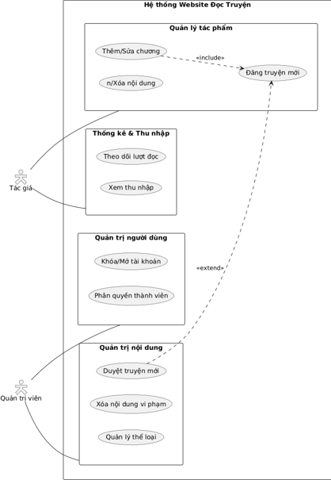

###  Tác giả (Author)
Tác giả là người sáng tạo nội dung, có quyền quản lý các tác phẩm cá nhân và theo dõi hiệu quả của truyện.
* **Nhóm Quản lý truyện cá nhân:**
    - Đăng truyện mới
    - Chỉnh sửa thông tin truyện (Tên, mô tả, ảnh bìa)
    - Thêm chương mới / Sửa chương
    - Xóa chương / Ẩn truyện
* **Nhóm Thống kê:**
    - Xem thống kê lượt đọc theo ngày/tháng
    - Theo dõi số lượng người theo dõi (Followers)
    - Xem báo cáo thu nhập (nếu có hệ thống trả phí)

### Quản trị viên (Admin)
Admin có quyền cao nhất, chịu trách nhiệm vận hành hệ thống và kiểm soát nội dung.
* **Nhóm Quản lý người dùng:**
    - Xem danh sách thành viên
    - Khóa/Mở khóa tài khoản vi phạm
    - Phân quyền (Thăng cấp lên Tác giả hoặc Mod)
* **Nhóm Quản lý nội dung:**
    - Duyệt truyện mới đăng
    - Xóa truyện/Chương vi phạm tiêu chuẩn cộng đồng
    - Quản lý bình luận (Xóa bình luận spam)
* **Nhóm Quản lý hệ thống:**
    - Quản lý danh mục thể loại truyện
    - Cấu hình các thông số website

    